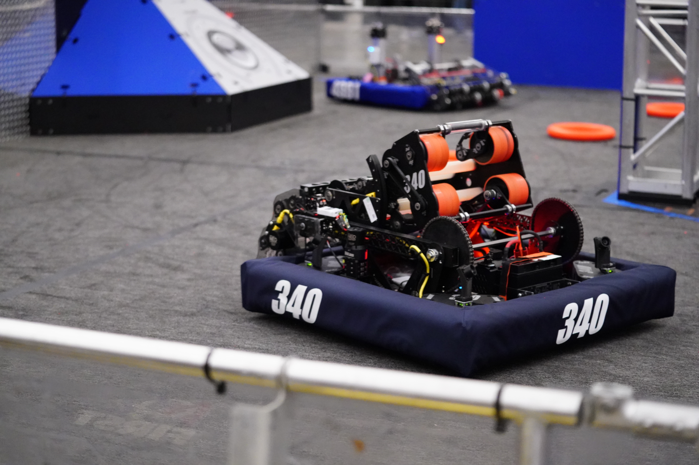

# Crescendo2024-340
FRC Team 340's code for the 2024 season, Crescendo.

### Highlights

- Full Field Localization

    Using 4 cameras for AprilTag tracking, the robot fuses measurements with varying weights based on trust factors with odometry to accurately determine the robot's position on the field throughout the entirety of a match.

- Auto Aiming and Shoot on the Move

    Utilizing full field localization, the robot automatically adjusts to aim at the speaker with the press of a single button, and performs calculations on the fly to adjust for its current velocity to enable shooting even while the robot is still in motion.

- Custom Dashboard

    The dashboard, built using Svelte + Tauri, includes a heads up display for the driver, an autonomous mode selection panel that displays animated previews of auto trajectories, and a menu to tune "fudge factors" of the robot's auto aiming in-match, in the case of hardware unreliability.

### Robot Logs
Logs from matches during the 2024 season can be found [here](https://github.com/Greater-Rochester-Robotics/RobotLogs/tree/main/2024).

 

